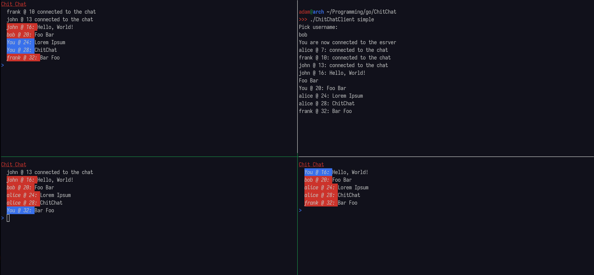

# ChitChat assignment

ChitChat is a simple group-chat application written in Go using gRPC, and with
simple Lamport logical clocks for ordering of messages.

ChitChat comes with a colorful TUI for POSIX Unix-like systems and a more plain, but still functional one for Windows.


## Project overview

Below one can see the project structure. Most of the directories represent
components which are used both in the client and the server. However, the
actual client and server code are contained within their respective directory.
```
root
| -- client  # The client source code
| -- clocks  # Logical clocks
| -- grpc    # Proto buffers files
| -- logs    # Log files from running server with 3 clients
| -- scripts # Scripts for automation of certain taks
| -- server  # The server source code
| -- ui      # A simple TUI library for POSIX unix systems
| -- utils   # Various utilities used in different parts of the project
```

## Building and running

### Using the helper script
In order to compile the project, one can use the build script
provided which invokes the go compiler for you.

The following script will produce two binaries, *ChitChatClient* and *ChitChatServer*.
```
./scripts/compile.sh 
```

Which then can be executed like so.
```
./ChitChatServer
./ChitChatClient
```

### Using the Go compiler directly
Alternatively, one can build and run the project directly using the go compiler directly.

When running the client, note that there are multiple source files, all of which
needs to be specified. Most shells, feature the wildcard(*) character, which
allows for simple pattern matching like so.
```
go run client/*.go
```

Running the server is similar to the client. Except the server is mostly self
contained and requires only providing the compiler a single file as an argument.
```
go run server/main.go
```

## Using the application

Once the server is up and running, you will see a log in the terminal
indicating that the server is running and listening for incoming connections on
a specific port(5001 by default).

As for the client, you will be presented with a terminal user interface, which
will prompt you for a username. Each client must have a unique username, the
server will automatically reject duplicates. Upon entering a unique username,
your client will log into the group chat. All other clients will get a message notifying
them of your presence.

### Accepted arguments

The client can be forced to use the colorful TUI or plain one via a single
argument. Note that the tui is not supported on Windows and it will be
bug-ridden due to Unix and Windows representing key strokes differently.
```
./ChitChatClient tui
./ChitChatClient simple
```


